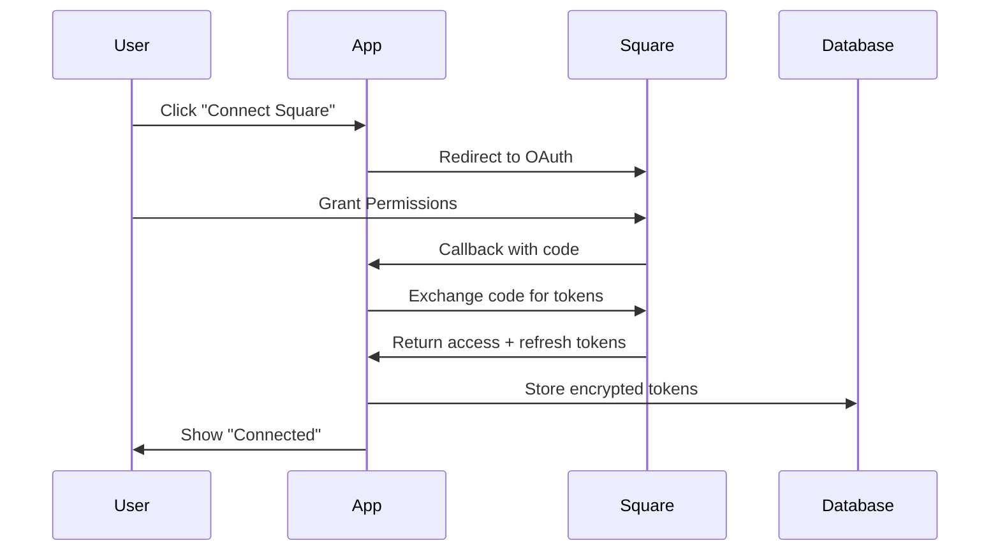
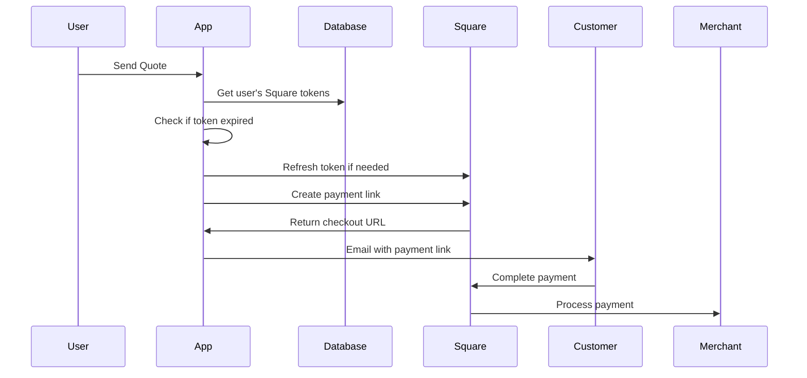

# Square OAuth Integration Setup Guide

## Overview

This guide explains how to set up Square OAuth integration so that each user can connect their own Square account to accept payments through your application.

## Architecture

The Square integration uses OAuth 2.0 to allow users to securely connect their Square accounts:

1. **User Clicks "Connect Square"** in Settings
2. **Redirects to Square OAuth** authorization page
3. **User Grants Permissions** to your app
4. **Square Redirects Back** with authorization code
5. **Exchange Code for Tokens** (access + refresh)
6. **Store Encrypted Tokens** in database
7. **Create Payment Links** using user's credentials

## Prerequisites

1. Square Developer Account (https://developer.squareup.com)
2. Square Application created
3. OAuth Redirect URI configured

---

## Step 1: Create Square Application

1. Go to https://developer.squareup.com/apps
2. Click **"Create app"** (or use existing app)
3. Give your app a name (e.g., "SignatureQuoteAI")
4. Note down your **Application ID**

---

## Step 2: Configure OAuth Redirect URI

### 2.1 Add Redirect URI in Square Dashboard

1. In your Square app, go to **OAuth** tab
2. Under **Redirect URL**, add:
   - **For Local Development**: `http://localhost:3000/api/integrations/square/callback`
   - **For Production**: `https://yourapp.com/api/integrations/square/callback`

3. Click **Save**

⚠️ **Important**: The redirect URI must match EXACTLY (including http/https, trailing slashes, etc.)

---

## Step 3: Configure Environment Variables

### 3.1 Add to `.env.local` (Development)

```bash
# Square OAuth Configuration
NEXT_PUBLIC_SQUARE_APPLICATION_ID=your_application_id_here
SQUARE_CLIENT_SECRET=your_client_secret_here
SQUARE_ENVIRONMENT=sandbox  # or 'production' for live

# App URL (used for OAuth redirects)
NEXT_PUBLIC_APP_URL=http://localhost:3000
```

### 3.2 Add to Vercel (Production)

```bash
# Via Vercel Dashboard
NEXT_PUBLIC_SQUARE_APPLICATION_ID=<your_app_id>
SQUARE_CLIENT_SECRET=<your_secret>
SQUARE_ENVIRONMENT=production
NEXT_PUBLIC_APP_URL=https://yourapp.vercel.app
```

Or via CLI:

```bash
vercel env add NEXT_PUBLIC_SQUARE_APPLICATION_ID production
vercel env add SQUARE_CLIENT_SECRET production
vercel env add SQUARE_ENVIRONMENT production
vercel env add NEXT_PUBLIC_APP_URL production
```

---

## Step 4: Run Database Migration

The Square integration requires new database fields to store user credentials.

```bash
# Connect to your Neon database
psql $DATABASE_URL

# Run the migration
\i lib/db/migrations/0007_add_square_integration.sql

# Verify tables
\d users
```

You should see new columns:
- `square_merchant_id`
- `square_access_token`
- `square_refresh_token`
- `square_token_expires_at`
- `square_location_id`
- `square_environment`
- `square_connected_at`
- `square_scopes`

---

## Step 5: Get Square Application Credentials

### Sandbox Credentials (for testing):

1. Go to **Credentials** → **Sandbox**
2. Copy **Application ID**
3. Copy **Application Secret**
4. These will be used in `.env.local` for development

### Production Credentials:

1. Go to **Credentials** → **Production**
2. Copy **Application ID**
3. Copy **Application Secret**
4. **IMPORTANT**: Only use production credentials on production server

---

## Step 6: Test OAuth Flow

1. Start development server:
   ```bash
   npm run dev
   ```

2. Navigate to **Settings** page: `http://localhost:3000/settings`

3. Find **Square Payment Integration** section

4. Click **"Connect Square Account"**

5. You should be redirected to Square's OAuth page

6. Grant permissions to the app

7. You should be redirected back to Settings with success message

8. Verify connection shows as "Connected" in Settings

---

## How It Works

### OAuth Flow



### Payment Link Creation



---

## Database Schema

```sql
-- Users table with Square integration
ALTER TABLE users ADD COLUMN square_merchant_id TEXT;
ALTER TABLE users ADD COLUMN square_access_token TEXT;
ALTER TABLE users ADD COLUMN square_refresh_token TEXT;
ALTER TABLE users ADD COLUMN square_token_expires_at TIMESTAMP;
ALTER TABLE users ADD COLUMN square_location_id TEXT;
ALTER TABLE users ADD COLUMN square_environment TEXT DEFAULT 'sandbox';
ALTER TABLE users ADD COLUMN square_connected_at TIMESTAMP;
ALTER TABLE users ADD COLUMN square_scopes TEXT;
```

---

## API Endpoints

### `/api/integrations/square/callback`
- **Method**: GET
- **Purpose**: OAuth callback handler
- **Parameters**: `code`, `state` (userId)
- **Returns**: Redirect to settings page

### `/api/integrations/square/disconnect`
- **Method**: POST
- **Purpose**: Disconnect user's Square account
- **Auth**: Required
- **Returns**: `{ success: boolean }`

### `/api/integrations/square/refresh`
- **Method**: POST
- **Purpose**: Manually refresh access token
- **Auth**: Required
- **Returns**: `{ success: boolean }`

---

## Security Best Practices

### Token Security

1. **Encrypt Tokens in Production**:
   ```typescript
   // TODO: Use encryption for production
   import { encrypt, decrypt } from '@/lib/encryption';

   // Before storing
   squareAccessToken: await encrypt(access_token)

   // When retrieving
   const token = await decrypt(user.squareAccessToken)
   ```

2. **Use Environment Variables**: Never hardcode credentials

3. **Rotate Tokens**: Implement automatic token refresh

4. **Secure Database**: Ensure database connections use SSL

### OAuth Security

1. **Validate State Parameter**: Prevents CSRF attacks
2. **Use HTTPS in Production**: Required for OAuth
3. **Verify Redirect URIs**: Must match exactly
4. **Short-Lived Access Tokens**: Auto-refresh when expired

---

## Troubleshooting

### Issue: "Redirect URI Mismatch"

**Cause**: The redirect URI doesn't match Square's configuration

**Solution**:
1. Check `NEXT_PUBLIC_APP_URL` in `.env.local`
2. Verify redirect URI in Square Dashboard includes `/api/integrations/square/callback`
3. Ensure protocol matches (http vs https)

### Issue: "Invalid Client Credentials"

**Cause**: Wrong Application ID or Secret

**Solution**:
1. Verify `NEXT_PUBLIC_SQUARE_APPLICATION_ID` is correct
2. Check `SQUARE_CLIENT_SECRET` matches your Square app
3. Ensure using sandbox credentials for `SQUARE_ENVIRONMENT=sandbox`

### Issue: "Token Expired" Errors

**Cause**: Access token expired and refresh failed

**Solution**:
1. Check `square_refresh_token` exists in database
2. Verify `SQUARE_CLIENT_SECRET` is correct
3. User may need to reconnect their account

### Issue: "Location Not Found"

**Cause**: User's Square account has no active locations

**Solution**:
1. User must create a location in Square Dashboard
2. Or manually set `square_location_id` to a valid location

---

## Testing Checklist

- [ ] Square app created in Developer Dashboard
- [ ] OAuth redirect URI configured
- [ ] Environment variables set in `.env.local`
- [ ] Database migration applied
- [ ] Development server running
- [ ] Can click "Connect Square" button
- [ ] Redirects to Square OAuth page
- [ ] Can grant permissions successfully
- [ ] Redirects back to app with success
- [ ] Connection shows as "Connected"
- [ ] Can create test payment link
- [ ] Can disconnect Square account
- [ ] Can refresh access token

---

## Production Deployment Checklist

- [ ] Production redirect URI added to Square app
- [ ] Production environment variables set in Vercel
- [ ] `SQUARE_ENVIRONMENT=production` in production
- [ ] `NEXT_PUBLIC_APP_URL` points to production domain
- [ ] Database migration applied to production
- [ ] HTTPS enabled (required for OAuth)
- [ ] Token encryption implemented
- [ ] Test OAuth flow on production
- [ ] Monitor Square API rate limits
- [ ] Set up error logging/monitoring

---

## Additional Resources

- [Square OAuth Documentation](https://developer.squareup.com/docs/oauth-api/overview)
- [Square Checkout API](https://developer.squareup.com/docs/checkout-api/what-it-does)
- [Square Payment Links](https://developer.squareup.com/docs/checkout-api/payment-links)
- [OAuth 2.0 Specification](https://oauth.net/2/)

---

**Last Updated**: January 2025
**Status**: Ready for implementation
